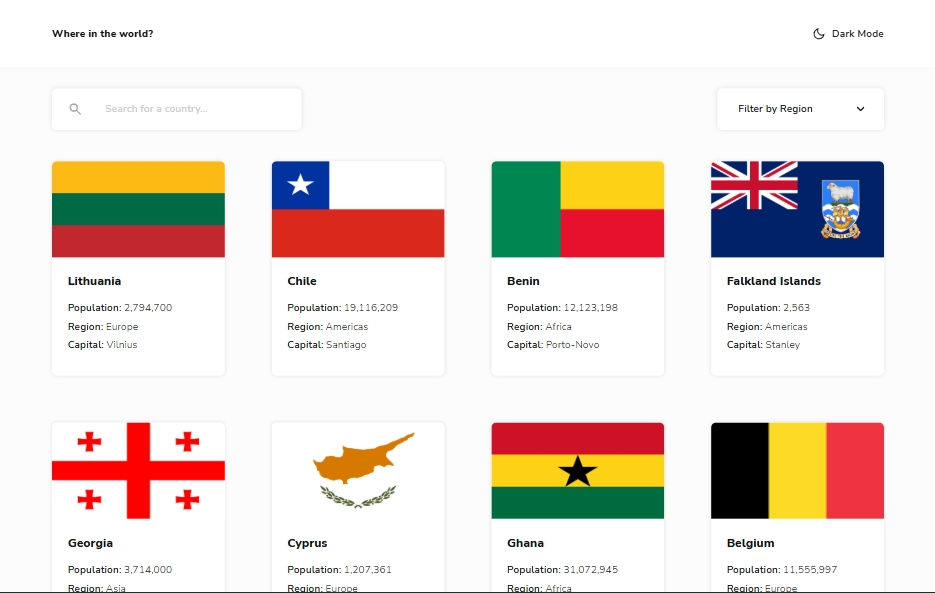

# Frontend Mentor - REST Countries API with color theme switcher solution

This is a solution to the [REST Countries API with color theme switcher challenge on Frontend Mentor](https://www.frontendmentor.io/challenges/rest-countries-api-with-color-theme-switcher-5cacc469fec04111f7b848ca). Frontend Mentor challenges help you improve your coding skills by building realistic projects. 

## Table of contents

- [Overview](#overview)
  - [The challenge](#the-challenge)
  - [Screenshot](#screenshot)
  - [Links](#links)
- [My process](#my-process)
  - [Built with](#built-with)
- [Author](#author)

## Overview

This is my first advanced project from Frontend Mentor, and it was a really great experience. Some features took time to get right, and I got to try out tricks I knew but never had the chance to use before. Overall, I learned a lot and enjoyed building it, challenging, but really rewarding.

I added a few extra features beyond the original challenge:
- Saved theme preference in local storage.
- Updated the region filter to include an “All” option.
- Added a scroll-to-top button.
- Remembered scroll position so users return to the same spot on the homepage.
- Used an updated version of the data JSON.

### The challenge

Users should be able to:

- See all countries from the API on the homepage
- Search for a country using an `input` field
- Filter countries by region
- Click on a country to see more detailed information on a separate page
- Click through to the border countries on the detail page
- Toggle the color scheme between light and dark mode *(optional)*

### Screenshot

### Links

- Solution URL: [GitHub Repo](https://github.com/zakaria-guenifi/rest-countries-api)
- Live Site URL: [live site URL](https://zakaria-guenifi.github.io/rest-countries-api/)

### Built with

- Semantic and Accessible HTML5 markup
- CSS custom properties
- Flexbox
- CSS Grid
- Mobile-first workflow
- Vanilla JS

## Author

- Website - [Zakaria Guenifi](https://guenifi.com)
- Frontend Mentor - [@zakaria-guenifi](https://www.frontendmentor.io/profile/zakaria-guenifi)
